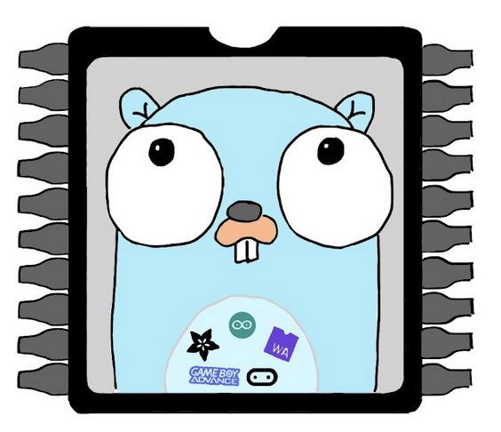

# TinyGo examples

After having installed TinyGo thanks to the [official documentation](https://tinygo.org/getting-started/install/) you may wonder what to do next.

First, you have to toy with the Hello World of electronics, the [Blink tutorial](https://tinygo.org/docs/tutorials/blinky/). 

Then, you can have a look at the documentation of the [target](https://tinygo.org/docs/reference/microcontrollers/) you want to use.

From there, we will try to show simple examples, on several platforms. 
Each folder is dedicated to one platform.

Do not hesitate to propose new examples on existing or new platform!

Platform list:
- [Clue](Clue/)
- [Nintendo Gameboy Advance](gba/)
- [M5Stack Core 2](M5Core2/)
- [micro:bit V2](microbitv2/)
- [Adafruit Pygamer](pygamer/)
- [Adafruit Pyportal Titano](titano/)
