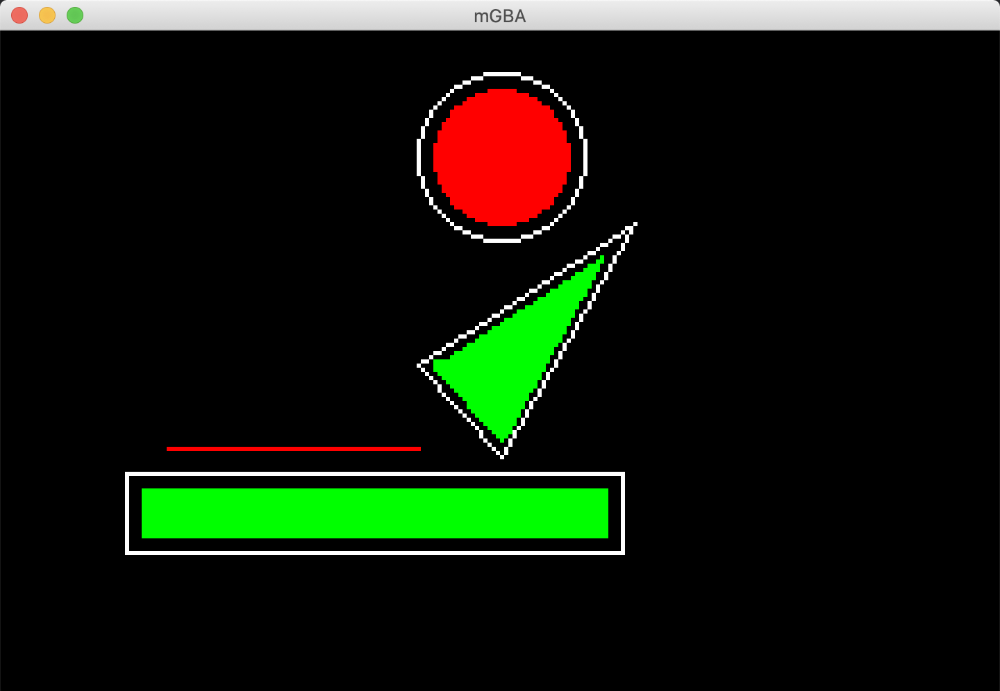

# gba/02-Draw

This repo contains an example for TinyGo Game Boy Advance.

We use:
* [TinyGo](https://tinygo.org/)
* [TinyDraw](https://github.com/tinygo-org/tinydraw)

## General

This simple app run on Game Boy Advance portable console and display several geometric figures.

## Pre-requisites

Install Go in 1.16 version minimum.

Install [TinyGo](https://tinygo.org/getting-started/install/).

Install [mGBA](https://tinygo.org/getting-started/install/macos/) emulator.

## Run the app (during development)

* For mGBA:
```
$ GOFLAGS=-mod=mod tinygo build -size short -o bin/draw.elf -target=gameboy-advance main.go ; mv bin/draw.elf bin/draw.gba
```

* For VisualBoyAdvance emulator or real GBA console:
```
$ tinygo run -target=gameboy-advance main.go
tinygo:ld.lld: warning: lld uses blx instruction, no object with architecture supporting feature detected
```

## Result



## Build the app

`$ tinygo build -size short -o bin/draw.gba -target=gameboy-advance main.go`

## Test the app/game

Let's run our app on mGBA emulator:

`$ mgba bin/draw.gba`

### mGBA Controls

Controls are configurable in the **settings** menu of **mGBA**. Many game controllers should be automatically mapped by default. 
The default keyboard controls are as follows:

```
A: X
B: Z
L: A
R: S
Start: Enter
Select: Backspace
```