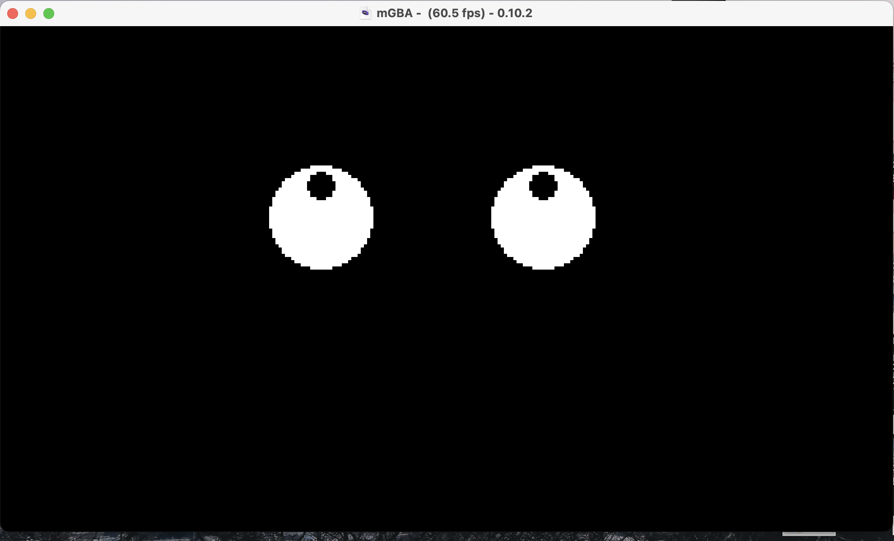

# gba/06-Eyes

This repo contains a simple game (yes, very very very simple game) for Game Boy Advance (GBA) in Go, with a basic code organization.

We use:
* [TinyGo](https://tinygo.org/)
* [TinyGBA](https://github.com/tinygo-org/tinygba)
* [TinyDraw](https://github.com/tinygo-org/tinydraw)

## General

This simple app/game run on Game Boy Advance portable console and:
* display eyes
* With multi directionnal arrows you can move eyes, to the left, right, top and bottom
* When you press START button: eyes are centered again

## Pre-requisites

Install Go in 1.16 version minimum.

Install [TinyGo](https://tinygo.org/getting-started/install/).

Install [mGBA](https://tinygo.org/getting-started/install/macos/) emulator.

## Run the app (during development)

```
$ tinygo run -target=gameboy-advance main.go
tinygo:ld.lld: warning: lld uses blx instruction, no object with architecture supporting feature detected
```

## Result



## Build the app

* For mGBA, VisualBoyAdvance emulator or real GBA console:

`$ GOFLAGS=-mod=mod tinygo build -o eyes.gba -target=gameboy-advance main.go`

## Test the app/game

Let's run our app on mGBA emulator:

`$ mgba eyes.gba`

### mGBA Controls

Controls are configurable in the **settings** menu of **mGBA**. Many game controllers should be automatically mapped by default. 
The default keyboard controls are as follows:

```
A: X
B: Z
L: A
R: S
Start: Enter
Select: Backspace
```