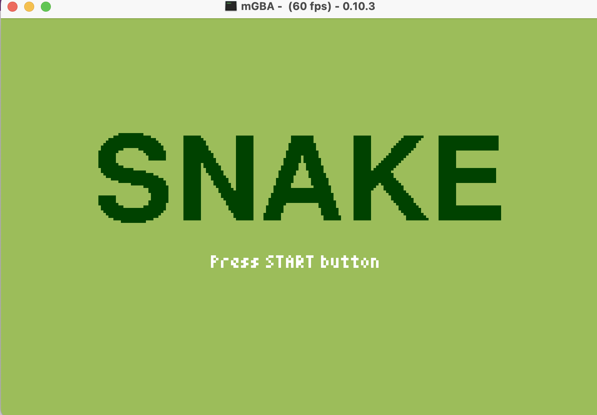

# gba/09-Snake

This repo contains a simple Snake game for Game Boy Advance (GBA) in Go, with a basic code organization.

We use:
* [TinyGo](https://tinygo.org/)
* [TinyGBA](https://github.com/tinygo-org/tinygba)
* [TinyFont](https://github.com/tinygo-org/tinyfont)

## General

This simple app/game run on Game Boy Advance portable console and run a "Snake" game.

* With multi directionnal arrows you can move the snake to the left, right, top or bottom
* When the snake eats a spider, the score increases and the snake grows
* When you press START button, the game begin again

## Pre-requisites

Install Go in 1.16 version minimum.

Install [TinyGo](https://tinygo.org/getting-started/install/).

Install [mGBA](https://tinygo.org/getting-started/install/macos/) emulator.

## Run the app (during development)

```
$ tinygo run -target=gameboy-advance .
```

## Result



## Build the app

* For mGBA, VisualBoyAdvance emulator or real GBA console:

```
$ GOFLAGS=-mod=mod tinygo build -o snake.gba -target=gameboy-advance .
```

## Test the app/game

Let's run our app on mGBA emulator:

```
$ mgba snake.gba
```

### mGBA Controls

Controls are configurable in the **settings** menu of **mGBA**. Many game controllers should be automatically mapped by default. 
The default keyboard controls are as follows:

```
A: X
B: Z
L: A
R: S
Start: Enter
Select: Backspace
```